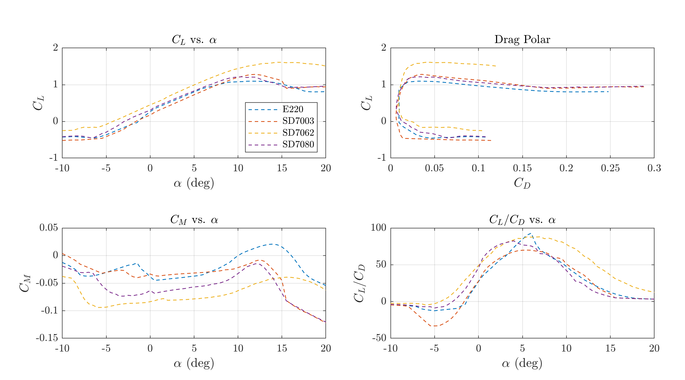

# RU Airborne Airfoil Analysis Tool - An XFoil Wrapper
## Capabilities
#### A simple XFoil plot wrapper to compare airfoils:

## Dependencies
### XFoil
XFoil 6.99 (the `xfoil.exe`, `pplot.exe`, and `pxplot.exe`) and are in the same directory as `xfoil.m`. This XFoil download comes built in to this download in the correct location.

### XFoil MATLAB Wrapper
This requires that MATLAB > v.2014b is installed.

This uses [this XFoil MATLAB wrapper written by Louis Edelman](https://www.mathworks.com/matlabcentral/fileexchange/49706-xfoil-interface-updated). It is already in the directory when you clone it.

### Python Airfoil Download Script
If you want to use the airfoil downloader, you will need to have Python installed. You can install Python [here](https://www.python.org/downloads/). You will probably need to add Python to PATH; this is shown [here](https://datatofish.com/add-python-to-windows-path/). Make sure that Python is added to PATH by typing `python` or `python3` in a command window. 

You will need the following libraries:
- numpy
- pandas

Both can be installed by typing the following in a command window:
    
    pip install numpy
    pip install pandas

## Installation
Clone this git repository if you know how to use git and want to contribute.

If not, go to the green "Code" dropdown, and download it as zip. Extract the zip to a directory of your choice, and now you can use it.

## Usage
Run `startup.m` to add necessary directories to path.

### `foil_sweep.m`
#### Variable declarations
- Specify foil names (must be downloaded in ./airfoils) in `airfoil_name` in line 3
- Change Reynolds number `Re` in line 5
- Change Mach number `Mach` in line 6
- Change angle of attack `alpha` to sweep in line 10

#### Run XFoil
This is where XFoil is called. You should see an XFoil window pop up when you run the section.

Some notes:
 - It is hard to run viscous simulations at low Reynolds numbers (what we are doing). Sometimes XFoil will run out of interpolation iteration and crash, so you will need to stop the MATLAB script from running, and choose a different airfoil.

#### Plotting results
This part is pretty self explanatory.

#### Plot airfoils
You can also plot the airfoils in a separate figure if you want.

### `download_airfoil_data.py`
Calls `get_airfoil` in `ruairborne_airfoil_analysis.py`. See docstrings for documentation

Modify `foils` line 6 so that is provides a list of foils to download. These can contain .dat, but do not have to. Standard NACA airfoils have already been downloaded, as well as other Selig-Donovan low Reynolds airfoils.

Run by typing in the command line:

    python download_airfoil_data.py

## To-do
- [ ] Add method for spline interpolation (hopefully for better accuracy)
- [ ] Make scripts easier to run
- [ ] Reynolds number sweep